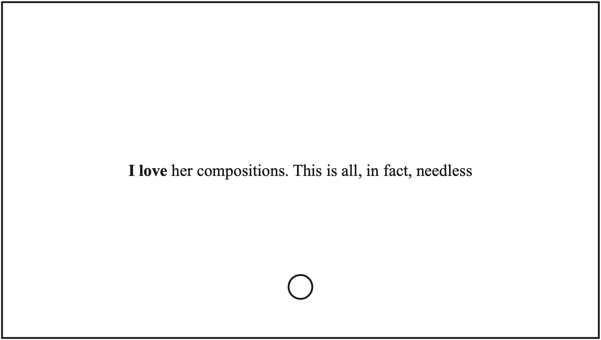

**{{ page.title }}**\
...or an experiment in non-collaboration with the machine 

2022\
_a generated poem in two parts and sixty cards_\
_commissioned by Garage MCA_\
[link to a .pdf](continue_the_phrase.pdf)

The text on the cards was generated by an LSTM artificial neural network trained using Leo Tolstoy’s diaries and writings on art.

In the first part of the poem (thirty cards), the start of the sentence was written by the author and continued by the neural network. The Tolstoy algorithm was invited to comment on the nature of art as well as on what it loves. The second part of the poem (thirty cards) consists of sentences starting with the personal pronouns _I, you, we_, also continued by the network, but with a gap, which the reader is invited to fill. 

The poem is meant to be performed: read aloud, sung, or translated into movement: whatever modality is chosen, the text was written to be transmitted through the reader’s body. The reader is invited to choose a random card from the first part and perform it, followed by one from the second part, where they can fill the gap the way they like. Then, the process is repeated. The reading of the poem ceases when the reader wishes to stop. 

Words, as we know, do not belong to the speaker, but they reflect the historical experiences of their society. The languages of criticism and art history were, for a long time, and to a degree still remain male languages. The first part of the poem illustrates the inertia of the art historical and literary discourses, which were dominated by male voices for centuries. In the second part, the reader is invited to overcome that inertia.  

Automated modes of writing can be used for the liberation of speech. A machine trained using a specific selection of texts can reveal all of the issues contained inside it. Working carefully with AI, we can clear the language of the clumps of violence, be it state or sexual. 

Automated writing is a way of collaboration. The writer takes a machine as a co-author—relatively passive on the one hand but unpredictable on the other. The algorithm trained on texts of the past reveals the inertia of the literary language. Can we write literature in a non-male voice? Can we express our feelings without the language of men’s literature? Processed by a neural network, the texts on the cards present the reader with those questions.

