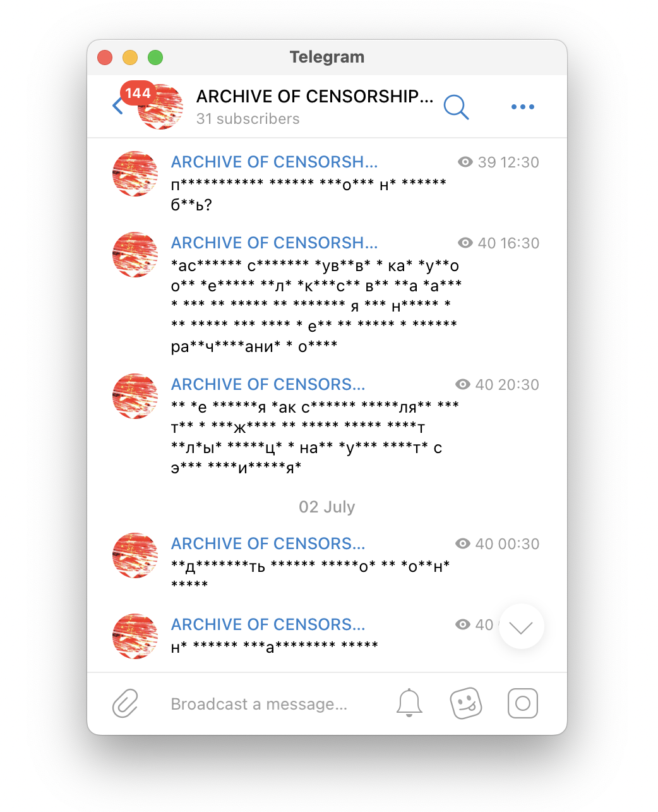

**{{ page.title }}**

2022

_telegram bot, telegram-mediated performance_\
[@archiveofanger](https://t.me/archiveofanger)

This telegram bot was active for 8 days in june, 2022. It took the my messages about the war in Ukraine and censored it. In 8 days, the censorship destroyed the messages completely, leaving no place for any meaning: all the symbols got replaced by the asterisks. 

8 days passed from the beginning of the Russian invasion of Ukraine to the introduction of Russian laws establishing war censorship. I was then in Moscow, and, just like other Russian citizens, I was forbidden to speak publicly against the war (and even call it «war» — instead of «special operation»). This work is a statement both against the war censorship and the war started by the Russian government — as well an archive of the forbidden feelings: rage, guilt and restlessness, which I felt then.

