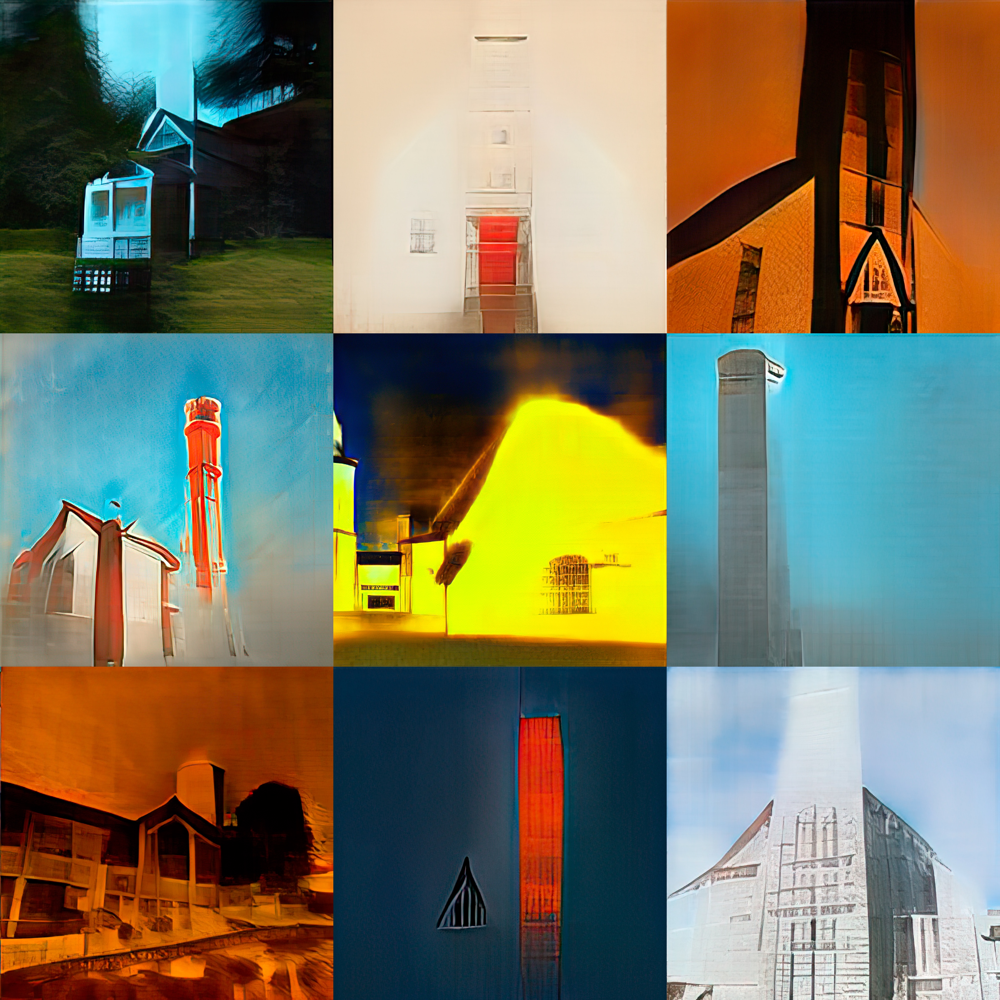

**{{ page.title }}**

2021\
_lightbox, video projection_\
_StyleGAN 2 generated graphics_

The StyleGAN2 neural network is trained on the pictures of churches and is re-trained on a dataset of in-game photography. The buildings from GTA San Andreas mix together with real architectural forms. The churches get stuck between the real world and rough polygons. The hidden light, then, starts to shine through the stock photos.

<iframe src="https://player.vimeo.com/video/597061706?h=0b2dcb60c3" frameborder="0" allow="autoplay; fullscreen; picture-in-picture" allowfullscreen></iframe>

