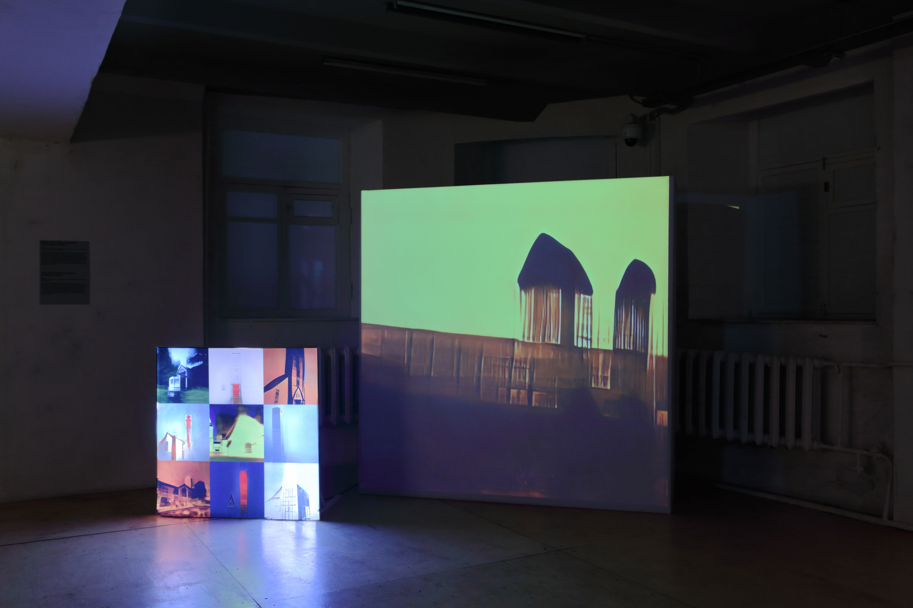

**{{ page.title }}**

The StyleGAN2 neural network is trained on the pictures of churches and is re-trained on a dataset of in-game photography. The buildings from GTA San Andreas mix together with real architectural forms. The churches get stuck between the real world and rough polygons. The light – previously hidden – shines through the stock photos.

<iframe src="https://player.vimeo.com/video/597061706?h=0b2dcb60c3" frameborder="0" allow="autoplay; fullscreen; picture-in-picture" allowfullscreen></iframe>