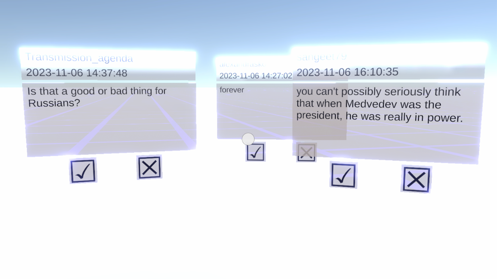

**{{ page.title }}: uncovering the truth machine**

2023\
_data-based procedural essay_\
_part of the [ununsubscribe](continue_the_phrase.md) pavilion at [TheWrongBiennale 2023](https://thewrong.org/)_\
available at [itch.io](https://netkachev.itch.io/trustcrowd)

In this non-game, you act as a crowdsource worker verifying whether a given Reddit comment is written by a pro-Russian bot or by a real person. The comments are retrieved semi-realtime and constantly updated. This is a work simulator, and the work will never come to an end.

Inside the AI-powered truth machines, human faces are hidden. Truth does not exist on its own: it is produced by the algorithms of digital media; but no algorithm is possible without the underpaid and monotonous labour of crowdsource workers.

Today’s web is imbued with disinformation and fakes spread by governments. Russian state is sponsoring the organizations — such as _[Internet Research Agency](https://edition.cnn.com/2023/02/14/europe/russia-yevgeny-prigozhin-internet-research-agency-intl/index.html)_ — whose only goal is to confuse the internet-users, both in Russia and outside it. When faced with a pro-Russian comment on Reddit, one can never be sure whether it is written by a real person or a bot, or perhaps by a professional troll. 

One way to fight the spreading of fakes and propaganda is to train an AI model that would decide if a given text is written by a bot or not. Indeed, in recent years, many such startups have emerged; people trust AI more than themselves. However, as the AI theorist Lilly Irani [claims](https://dl.acm.org/doi/10.1145/3014390), automation has hidden human faces; the existence of AI is secured by underpaid labor of countless crowdsource workers. 

In this (non-)game, players become such a worker. They confront real comments from the [r/AskARussian](https://www.reddit.com/r/AskARussian/) subreddit, a thriving ground for actual bots and paid trolls. As responsible as this task may seem, it’s also monotonous. The work never comes to its end: to remind you that, according to Irani, crowdsourcers do not even earn the minimum wage in their countries. That’s how the truth is actually produced today: even truth machines have hidden human faces.

